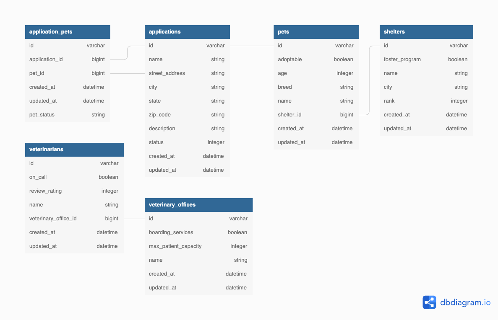

# Adopt, don't Shop

By Deannah Burke and Antonio Salmeron

### Existing database design

## Learning Goals

In this project, we built upon code to create a Pet Adoption Platform. Users are able to apply to adopt pets, and Admins will be able to approve or reject applications and see statistics for the Shelters, Pets, and Applications in the system.

## Visit the Application on Heroku
https://adopt-dont-shop-17.herokuapp.com/
